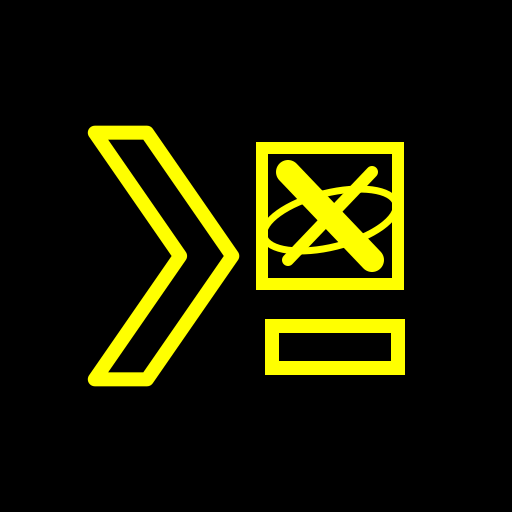

<div align="center">



# 白い熊 Termux X11

**The Termux X server add-on — an X window that never throttles your shell, with one-zip backups a sister app can run for you.**

A fork of [Termux:X11](https://github.com/termux/termux-x11) (`termux/termux-x11`) with **major additions**: the `sharedUid` flavour as the only shipped shape (the X window lives in Termux's own process, so Termux is never background-throttled while a graphical app is in front), the **白い熊 Termux X11 UI** page (long-press the gear extra key), **Export / Import** of every preference to a single `.zip`, the sister-app **backup-automation contract v2** so 保存復元 can back the app up unattended, a **matching companion `termux-x11-nightly` package** whose loader accepts this fork's signature, the black/yellow traced launcher icon, and a version string pinned to the exact upstream commit each build sits on.

Installs **over** the stock Termux:X11 (app id `com.termux.x11` kept so the Termux package ecosystem keeps working); the whole family — Termux, Termux API, Termux X11, Termux GUI and 白い熊 GNU Emacs — shares Android UID `com.termux` and is signed with one key, so every member must come from these forks.

**📥 Latest release: [`1.03.01+2026-09-15.13-25.g9df6ca26+004`](https://github.com/ShiroiKuma0/shiroikuma-termux-x11/releases/latest)** — [all releases & downloads »](https://github.com/ShiroiKuma0/shiroikuma-termux-x11/releases) · [changelog »](CHANGELOG.md)

</div>

---

## 🪟 An X window that never throttles Termux

Upstream's nightly ships both of its flavours as debug builds, `standalone` first; this fork builds and ships **only the `sharedUid` flavour, as a signed release build**: `sharedUserId="com.termux"` and `android:process="com.termux"` on every component, so the X server activity, the preferences screen and every broadcast receiver run *inside Termux's process*. The practical difference is the one you feel every day — when the X window is in front, Android sees **Termux itself** as the foreground app, and your shell, your compiler and your X clients never fall into the background cpuset while you look at their output. Because the entire `com.termux` family is signed with one key, the shared UID matches Termux's by construction.

---

## 🐻 The 白い熊 Termux X11 UI page

One black-and-yellow page in the house look — section headings underlined in `#FFFF00`, 72 dp rows, pill buttons, bordered black dialogs — holding everything this fork adds. It is never more than one gesture away:

- **long-press the gear key** (PREFERENCES) on the extra-keys bar — a generic long-press hook added to `ExtraKeysView` that upstream's keys did not have;
- **long-press the Preferences button** on the not-connected screen;
- the **launcher shortcut** `白い熊 Termux X11 UI` (long-press the app icon);
- the **first row** of upstream's Preferences screen.

The page carries the Export / Import section (with the automation rows inside it) and a Reset row that clears only the page's own preferences file. The preferences screen's *version* row shows the fork version string, so you always know which upstream commit you are running.

---

## 📦 Export / Import — every preference in one `.zip`

「Export / Import…」 opens the family's panel: a bordered box with a red/yellow export-directory field (a SAF folder, chosen once), the last-export line, 全選択 + category checkboxes, and the pill row Cancel ‖ Import Export. An export writes `shiroikuma-termux-x11_<yyyy-MM-dd_HH-mm-ss>.zip` — `manifest.json` plus a type-tagged `settings.json` of every SharedPreferences file (display, pointer, keyboard, extra keys, the secondary-display copy) — as a `.part` file renamed only when complete. Import is a per-key merge, committed synchronously, restricted to the categories the archive carries; it ends with 「Later」 / 「Restart now」, and *Restart now* relaunches the X window alone — never `Runtime.exit`, because in the `sharedUid` flavour that would kill every Termux session. The export directory and the automation switch are device-local and never travel inside a backup.

---

## 🤖 Backed up unattended by 保存復元

The fork implements the sister-app **backup-automation contract v2**, so one 自由作業盤 task can back up every 白い熊 app in a batch and 応用管理 can restore them onto a clean phone:

- a headless **`EXPORT_STATE` / `LIST_CATEGORIES` / `CANCEL_EXPORT`** receiver that writes the same `.zip` the panel does and answers with exactly one reply broadcast (`FLAG_INCLUDE_STOPPED_PACKAGES`, no binders — the shape proven on EMUI);
- the **`com.termux.x11.automation` data door** — a content provider with `describe` / `export` / `import` / `cancel`, which identifies its caller by exact package name, kernel uid *and* pinned signing certificate before it moves a byte through the caller's descriptor, backed by a `dataSync` foreground service;
- **progress broadcasts** with a 500 ms throttle and a 20 s heartbeat;
- the rows on the UI page: 「Automation export」 (ON by default), 「Use authorization token?」 (OFF) and the token row with a Regenerate pill, all `commit()`ed so a force-stop never loses a switch.

---

## 📀 The matching companion package

The `termux-x11` command in the Termux prefix is a loader that verifies the **signing certificate** of the installed app before it will load it. The stock `termux-x11-nightly` package from `packages.termux.dev` is built against upstream's test key and prints *“Signature verification of target application com.termux.x11 failed”* with this app. Every release therefore ships **two artefacts at one version**: the signed `…_sharedUid.apk` and a `…_termux-x11-nightly.deb` whose loader carries the family certificate. Its internal Debian version stays upstream's `1.03.01-0`, so it replaces the stock package in place — see *Installing* below.

---

## ⚫🟡 The traced icon, and our name everywhere

The launcher art is a black/yellow line tracing — the chevron, the X box with its orbit, the underscore — generated from `design/shiroikuma-termux-x11-icon.svg` by `tools/icon/emit_launcher.py` into upstream's own file names (adaptive background / foreground / monochrome included), so upstream's adaptive-icon wrappers stay untouched. The app is **白い熊 Termux X11** on the launcher, in the notification (channel and title), on the accessibility-service row; the HELP button, the loader's error messages and the `.deb`'s `Homepage:` all point at this repository.

---

## 🔑 One family, one key

Five apps share Android UID `com.termux` — [shiroikuma-termux](https://github.com/ShiroiKuma0/shiroikuma-termux), [shiroikuma-termux-api](https://github.com/ShiroiKuma0/shiroikuma-termux-api), **shiroikuma-termux-x11** (this repo), [shiroikuma-termux-gui](https://github.com/ShiroiKuma0/shiroikuma-termux-gui) and [shiroikuma-emacs](https://github.com/ShiroiKuma0/shiroikuma-emacs) (白い熊 GNU Emacs, `shiroikuma.emacs`, installs side-by-side with the stock `org.gnu.emacs`). A shared UID demands one certificate across all of them, so the Termux-family forks keep upstream's app ids and install *over* the stock apps, and a stock Termux cannot coexist with a fork member. The signed build is reproducible: `keystore.properties` (gitignored) feeds both the release signing config and the debug one the loader derives its certificate check from.

---

## 🔢 A version that names the upstream commit

Termux:X11 has no releases — its `nightly` tag moves with every `master` commit while the literal `1.03.01` stands still for months. This fork rebases `custom` onto every upstream commit and pins the base in the version:
`<upstream version>+<upstream base date>.<HH-MM>.g<sha8>+<NNN>`, e.g. `1.03.01+2026-09-15.13-25.g9df6ca26+004` — upstream `9df6ca26` committed 2026-09-15 13:25 UTC, our fourth build overall, the first on that base. `versionCode` = upstream code × 10000 + N, and the build counter runs monotonically across syncs so an update is never a downgrade.

---

## Family

- [shiroikuma-termux](https://github.com/ShiroiKuma0/shiroikuma-termux) — 白い熊 Termux (`com.termux`)
- [shiroikuma-termux-api](https://github.com/ShiroiKuma0/shiroikuma-termux-api) — 白い熊 Termux API (`com.termux.api`)
- **shiroikuma-termux-x11** — 白い熊 Termux X11 (`com.termux.x11`, this repo)
- [shiroikuma-termux-gui](https://github.com/ShiroiKuma0/shiroikuma-termux-gui) — 白い熊 Termux GUI (`com.termux.gui`)
- [shiroikuma-emacs](https://github.com/ShiroiKuma0/shiroikuma-emacs) — 白い熊 GNU Emacs (`shiroikuma.emacs`)

## Built on Termux:X11

A fork of [Termux:X11](https://github.com/termux/termux-x11) (app id `com.termux.x11` kept, so it installs over the official build and the `termux-x11` tooling keeps working). Termux:X11 is a fully fledged X.Org server built with the Android NDK and tuned for Termux — the whole X stack (`xserver`, `libx11`, `pixman`, …) arrives as sixteen git submodules that this fork never patches. The code remains under the [GNU General Public License v3](LICENSE).

## Installing

1. Install `shiroikuma-termux-x11_<version>_sharedUid.apk` from the [releases page](https://github.com/ShiroiKuma0/shiroikuma-termux-x11/releases). It upgrades the installed `com.termux.x11` in place (same id, same family key, higher `versionCode`); a *stock* Termux:X11 must be uninstalled first, since its certificate differs.
2. In Termux, install the matching companion package and hold it, or the next `pkg upgrade` swaps the loader back to the stock one that refuses this app:

   ```sh
   dpkg -i shiroikuma-termux-x11_<version>_termux-x11-nightly.deb
   apt-mark hold termux-x11-nightly
   ```

## Building

The repo uses submodules — clone with them, on the `custom` branch:

```sh
git clone --recurse-submodules -b custom https://github.com/ShiroiKuma0/shiroikuma-termux-x11
cd shiroikuma-termux-x11
git submodule update --init --recursive     # after every checkout that moves a gitlink
```

Toolchain: JDK **21** (the default `java` may be older — Gradle 9.x refuses it), the Android SDK with `compileSdk 34`, NDK **`29.0.14206865`** exactly (`termuxX11NdkVersion` in `lorie/version.gradle`), CMake ≥ 3.22, `python3`, `bison` and `patch` on `PATH`. Gradle reads the SDK path from a gitignored `local.properties` (`sdk.dir=/path/to/android-sdk`).

Signing: copy `keystore.properties_sample` to `keystore.properties` (gitignored, repo root) and fill in the keystore that signs the whole `com.termux` family — `buildFork` refuses to run without it, because an unsigned APK would neither install over the signed one nor pass the loader's certificate check. The script wires that keystore to **both** `signingConfigs.release` and `signingConfigs.debug`; the latter is what `shell-loader/build.gradle` computes the loader's `BuildConfig.SIGNATURE` from.

```sh
# Signed sharedUid release APK + companion .deb → ~/tmp, then BUILD_NUMBER is bumped (the shippable build)
JAVA_HOME=/usr/lib/jvm/java-21-openjdk-amd64 ./gradlew buildFork --console=plain < /dev/null

# Release APK only (no copy, no bump) — under lorie-app/build/outputs/apk/sharedUid/release/
JAVA_HOME=/usr/lib/jvm/java-21-openjdk-amd64 ./gradlew :lorie-app:assembleSharedUidRelease

# Companion package only (.deb + .pkg.tar.xz under shell-loader/build/outputs/companion/)
JAVA_HOME=/usr/lib/jvm/java-21-openjdk-amd64 ./gradlew :shell-loader:buildCompanionPackage
```

`buildFork` = `:lorie-app:assembleSharedUidRelease` (R8 minify + resource shrink, all four ABIs in one universal APK) + `:shell-loader:buildCompanionPackage`; it copies the pair to `~/tmp/` as `shiroikuma-termux-x11_<versionName>_sharedUid.apk` and `shiroikuma-termux-x11_<versionName>_termux-x11-nightly.deb`, then increments `BUILD_NUMBER` in `gradle.properties`. A cold build compiles the X server for four ABIs — tens of minutes on a slow box. Only the `sharedUid` flavour is ever shipped.

---

> **Everything below is upstream's own Termux:X11 manual, kept verbatim** — the setup, the
> `termux-x11` command, gestures, notification, proot/chroot notes and preferences from the command
> line all apply unchanged to this fork (read “Termux:X11” as 白い熊 Termux X11).

# Termux:X11

[](https://github.com/termux/termux-x11/actions/workflows/debug_build.yml) [](https://gitter.im/termux/termux) [](https://discord.gg/HXpF69X)

A [Termux](https://termux.com) X11 server add-on app.

## About
Termux:X11 is a fully fledged X server. It is built with Android NDK and optimized to be used with Termux.

## Submodules caveat
This repo uses submodules. Use 

```
git clone --recurse-submodules https://github.com/termux/termux-x11 
```
or
```
git clone https://github.com/termux/termux-x11
cd termux-x11
git submodule update --init --recursive
```

## How does it work?
Just like any other X server.

## Setup Instructions
Termux:X11 requires Android 8 or later. It consists of an Android app and a companion termux package, and you must install both.

The Android app is available via the [nightly release tag](https://github.com/termux/termux-x11/releases/tag/nightly) of this repository. Download and install `termux-x11-universal-debug.apk`.

The companion termux package is available from the termux graphical repository. You can ensure it's enabled and install this package with `pkg i x11-repo && pkg i termux-x11-nightly`. If you need to, you can also download a `.deb` or `*.tar.xz` from the same nightly release tag as above.

### Avoiding slowdowns
<details>
<summary>Android gives less CPU time to apps that aren't on screen — install the sharedUid APK to avoid this</summary>

Android gives less CPU time to apps that aren't on screen. Once Termux:X11 opens, Android treats Termux itself as no longer being on screen, so things running inside Termux (like your desktop apps) can slow down.

To avoid this, install `termux-x11-universal-sharedUid-debug.apk` instead of the regular one (same [nightly release tag](https://github.com/termux/termux-x11/releases/tag/nightly) or CI artifacts). This variant runs as part of Termux itself, so Android keeps treating it as one app and doesn't slow it down.

This variant only works with the Termux app installed **from GitHub**, not F-Droid or Google Play — those are signed with different keys, and a shared UID requires matching signatures.
</details>

Finally, most people will want to use a desktop environment with Termux:X11. If you don't know what that means or don't know which one to pick, run `pkg i xfce` (also from `x11-repo`) to install a good one to start with. The rest of these instructions will assume that your goal is to run an XFCE desktop, or that you can modify the instructions as you follow them for your actual goal.

## Running Graphical Applications
You can start your desired graphical application by doing:
```
termux-x11 :1 -xstartup "dbus-launch --exit-with-session xfce4-session"
```
or
```
termux-x11 :1 -- dbus-launch --exit-with-session xfce4-session
```
or
```
termux-x11 :1 &
env DISPLAY=:1 dbus-launch --exit-with-session xfce4-session
```
You may replace `xfce4-session` if you use other than Xfce

`dbus-launch` does not work for some users so you can start session with
```
termux-x11 :1 -xstartup "xfce4-session"
```

Also you can do 
```
export TERMUX_X11_XSTARTUP="xfce4-session"
termux-x11 :1
```
In this case you can save TERMUX_X11_XSTARTUP somewhere in `.bashrc` or other script and not type it every time you invoke termux-x11.  


If you're done using Termux:X11 just simply exit it through its notification drawer by expanding the Termux:X11 notification then "Exit"
But you should pay attention that `termux-x11` command is still running and can not be killed this way.

For some reason some devices output only black screen with cursor instead of normal output so you should pass `-legacy-drawing` option.
```
termux-x11 :1 -legacy-drawing -xstartup "xfce4-session"
```

For some reason some devices show screen with swapped colours, in this case you should pass `-force-bgra` option.
```
termux-x11 :1 -force-bgra -xstartup "xfce4-session"
```

## Using with proot environment
If you plan to use the program with proot, keep in mind that you need to launch proot/proot-distro with the --shared-tmp option. 

If passing this option is not possible, set the TMPDIR environment variable to point to the directory that corresponds to /tmp in the target container.

If you are using proot-distro you should know that it is possible to start `termux-x11` command from inside proot container.

Example, run in a Termux shell (not inside the proot container):
```
termux-x11 :1 &
proot-distro login ubuntu --shared-tmp
```
Then, inside the container:
```
export DISPLAY=:1
dbus-launch --exit-with-session xfce4-session
```

## Using with chroot environment
If you plan to use the program with chroot or unshare, you must run it as root and set the TMPDIR environment variable to point to the directory that corresponds to /tmp in the target container.

This directory must be accessible from the shell from which you launch termux-x11, i.e. it must be in the same SELinux context, same mount namespace, and so on.

Also you must set `XKB_CONFIG_ROOT` environment variable pointing to container's `/usr/share/X11/xkb` directory, otherwise you will have `xkbcomp`-related errors.

You can get loader for nightly build from an artifact of [last successful build](https://github.com/termux/termux-x11/actions/workflows/debug_build.yml)

Do not forget to disable SELinux
```
setenforce 0
export TMPDIR=/path/to/chroot/container/tmp
export CLASSPATH=$(/system/bin/pm path com.termux.x11 | cut -d: -f2)
/system/bin/app_process / --nice-name=termux-x11 com.termux.x11.CmdEntryPoint :0
```

### Force stopping X server (running in termux background, not an activity)

termux-x11's X server runs in process with name "termux-x11". You can kill it by
```
pkill termux-x11
```

### Closing Android activity (running in foreground, not X server)

```
am broadcast -a com.termux.x11.ACTION_STOP -p com.termux.x11
```

### Opening Termux:X11 activity from command line

```
am start --user 0 -n com.termux.x11/com.termux.x11.MainActivity
```

### Logs
If you need to obtain logs from the `com.termux.x11` application,
set the `TERMUX_X11_DEBUG` environment variable to 1, like this:
`TERMUX_X11_DEBUG=1 termux-x11 :0`

The log obtained in this way can be quite long.
It's better to redirect the output of the command to a file right away.

### Notification
In Android 13, posting notifications was restricted so you should explicitly let Termux:X11 show you notifications.
<details>
<summary>Video</summary>

[img_enable-notifications.webm](https://user-images.githubusercontent.com/9674930/227760411-11d440eb-90b8-451e-9024-d5a194d10b16.webm)

</details>

Preferences:
You can access preferences menu three ways:
<details>
<summary>By clicking "PREFERENCES" button on main screen when no client connected.</summary>


</details>
<details>
<summary>By clicking "Preferences" button in notification, if available.</summary>


</details>
<details>
<summary>By clicking "Preferences" application shortcut (long tap `Termux:X11` icon in launcher). </summary>


</details>

## Toggling keyboard
Just press "Back" button.

## Touch gestures
### Touchpad emulation mode.
In touchpad emulation mode you can use the following gestures:
* Tap for click
* Double tap for double click
* Two-finger tap for right click
* Three-finger tap for middle click
* Two-finger vertical swipe for vertical scroll
* Two-finger horizontal swipe for horizontal scroll
* Three-finger swipe down to show-hide additional keys bar.
### Simulated touchscreen mode.
In simulated touchscreen mode you can use the following gestures:
* Single tap for left button click.
* Long tap for mouse holding.
* Double tap for double click
* Two-finger tap for right click
* Three-finger tap for middle click
* Two-finger vertical swipe for vertical scroll
* Two-finger horizontal swipe for horizontal scroll
* Three-finger swipe down to show-hide additional keys bar.

## Font or scaling is too big!
Some apps may have issues with X server regarding DPI. please see https://wiki.archlinux.org/title/HiDPI on how to override application-specific DPI or scaling.

You can fix this in your window manager settings (in the case of xfce4 and lxqt via Applications Menu > Settings > Appearance). Look for the DPI value, if it is disabled enable it and adjust its value until the fonts are the appropriate size.
<details>
<summary> Screenshot </summary>

 
</details>

Also you can start `termux-x11` with `-dpi` option.
```
termux-x11 :1 -xstartup "xfce4-session" -dpi 120
```

## Changing, dumping and restoring preferences from commandline

It is possible to change preferences of termux-x11 from command line.
`termux-x11-nightly` package contains `termux-x11-preference` tool which can be used like 
```shell
termux-x11-preference [list] {key:value} [{key2:value2}]...
```

Use `termux-x11-preference list` to dump current preferences.
Use `termux-x11-preference list > file` to dump current preferences to file.
Use `termux-x11-preference < file` to restore preferences from file.
Use `termux-x11-preference "fullscreen"="false" "showAdditionalKbd"="true"` to disable fullscreen and enable additional key bar. The full list of preferences you can modify is available with `termux-x11-preference list` command. You can specify one or more preferences here.

Termux:X11 activity should be available in background or foreground, otherwise `termux-x11-preference` tool will hang indefinitely.
In the case if there is `Store preferences for secondary displays separately` preference active `termux-x11-preference` will use/modify preferences of display where Termux:X11 activity is currently opened.

## Using with 3rd party apps
It is possible to use Termux:X11 with 3rd party apps.
Check how `shell-loader/src/main/java/com/termux/x11/Loader.java` works.

# License
Released under the [GPLv3 license](https://www.gnu.org/licenses/gpl-3.0.html).
